# Provision an Oracle Container Engine for Kubernetes

## Preparing Container Engine for Kubernetes

Before you can use Container Engine for Kubernetes to create a Kubernetes cluster:

- You must have access to an Oracle Cloud Infrastructure tenancy

- Your tenancy must have sufficient quota on different types of resource
  - at least one compute instance (node) must be available in the tenancy or three compute instances (one in each availability domain) to create a highly available cluster
  - at least one load balancer to distribute traffic between the nodes running a service in a Kubernetes cluster

- A suitably pre-configured compartment must already exist in each region in which you want to create and deploy clusters. If you are using a GSE environment, then you should use the **Demo** compartment and **api.user** as the local OCI login account.
  - The compartment must contain the necessary network resources already configured (VCN, subnets, internet gateway, route table, security lists) before you can create and deploy a cluster. For example, to create a highly available cluster spanning three availability domains, the VCN must include three subnets in different availability domains for node pools, and two further subnets for load balancers.
 
- Within the root compartment of your tenancy, a policy statement (allow service OKE to manage all-resources in tenancy) must be defined to give Container Engine for Kubernetes access to resources in the tenancy.

- To create and/or manage clusters, you must belong to one of the following (**api.user** if using GSE environment):
  - The tenancy's Administrators group
  - A group to which a policy grants the appropriate Container Engine for Kubernetes permissions
  
- To perform operations on a cluster:
  - You must have installed and configured the Kubernetes command line tool `kubectl`
  - You must have downloaded the cluster's `kubeconfig` file

The following steps illustrates how you can do the above.

### **STEP 1**: Create Policy for Container Engine

To create and manage clusters in your tenancy, Container Engine must have access to all resources in the tenancy. To give Container Engine the necessary access, create a policy for the service as follows:

- In the Console, click **Identity**, and then click **Policies**. A list of the policies in the compartment you're viewing is displayed.

- Select the tenancy's **root** compartment from the list on the left

- Click **Create Policy**

- Enter the following:
  - **Name:** `oke-service`
  - **Description:** `allow OKE to manage all-resources in tenancy`
  - **Policy Versioning:** Select **Keep Policy Current**
  - **Statement:** The following policy statement:
  `allow service OKE to manage all-resources in tenancy`

- Leave the rest to default

- Click **Create**

  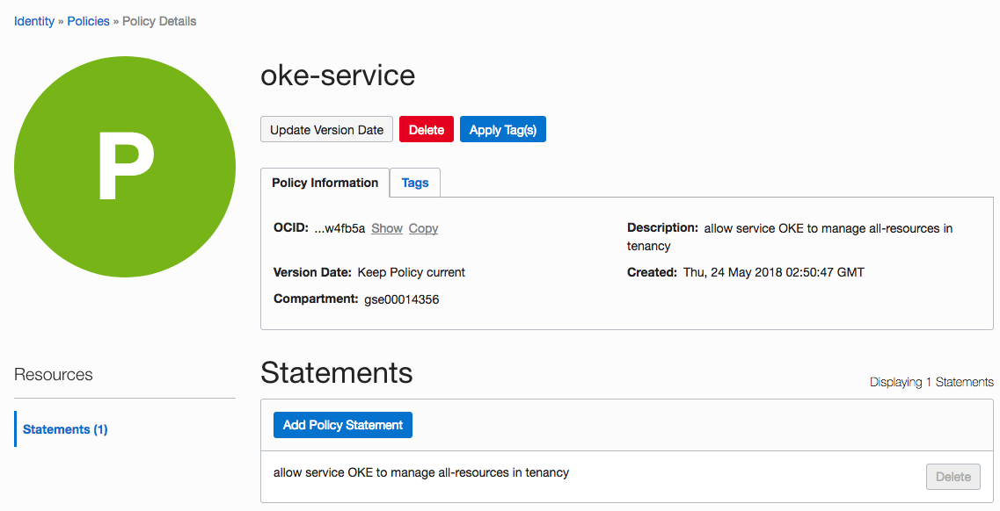

### **STEP 2**: Configuring Network Resources

You must create a VCN for your cluster and it must include the following:

  - The VCN must have a CIDR block defined that is large enough for at least five subnets, in order to support the number of hosts and load balancers a cluster will have
  - The VCN must have an internet gateway defined
  - The VCN must have a route table defined that has a route rule specifying the internet gateway as the target for the destination CIDR block
  - The VCN must have five subnets defined, three subnets in which to deploy worker nodes and two subnets to host load balancers.

### **STEP 2.1**: VCN Configuration

- In the Console, click **Networking**, and then click **Virtual Cloud Network**

- Select your the tenancy's **Demo** compartment (for GSE env) from the list on the left

- Click **Create Virtual Cloud Network**

- Enter the following:
  - **Name:** `oke-cluster`
  - **CIDR Block:** `10.0.0.0/16`
  - **DNS Resolution:** Check box to **USE DNS HOSTNAMES IN THIS VCN**

- Leave the rest to default (Compartment defaults to **Demo** for GSE env)

- Click **Create Virtual Cloud Network**

  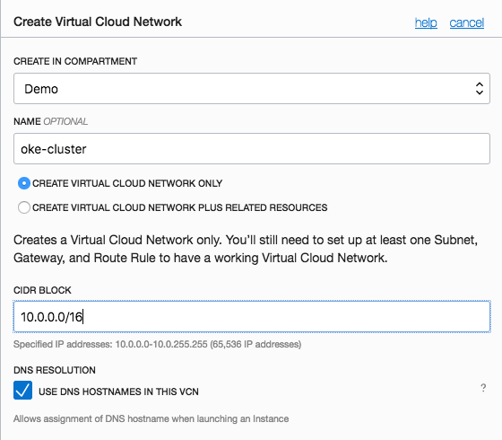

### **STEP 2.2**: Internet Gateway Configuration

The VCN must have an internet gateway. The internet gateway must be specified as the target for the destination CIDR block 0.0.0.0/0 in a route rule in a route table.

Once the **oke-cluster** VCN is created

- Click on the **oke-cluster** VCN to enter the details page

- Select **Internet Gateways** from the list on the left and click on **Create Internet Gateway**

- Enter the following:
  - **Name:** `oke-gateway-0`

- Leave the rest to default (Compartment defaults to **Demo** for GSE env)

- Click **Create Internet Gateway**

  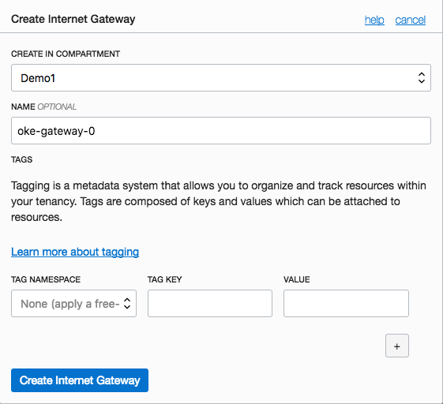

### **STEP 2.3**: Route Table Configuration: 

The VCN must have a route table. The route table must have a route rule that specifies an internet gateway as the target for the destination CIDR block 0.0.0.0/0.

- Select **Route Tables** from the list on the left

  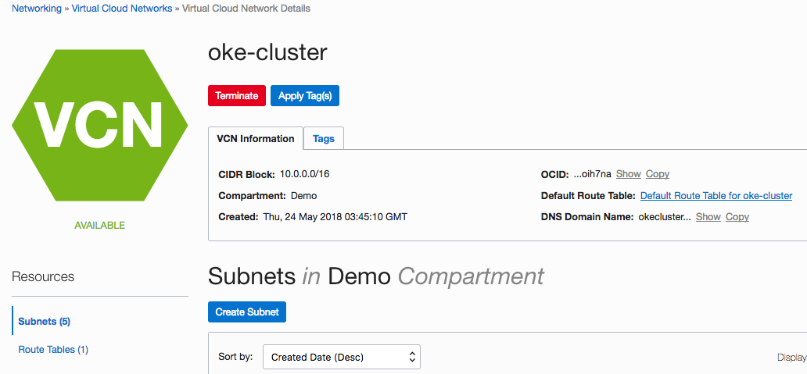

  A `Default Route Table for oke-cluster` should have been created for you, similar to below.

  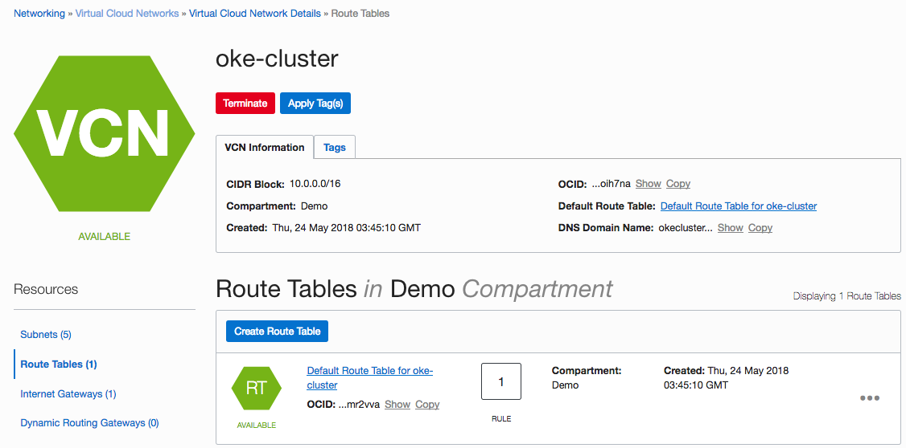

If a default Route Table has not been created for you, then create a new Route Table.

- Click **Create Route Table**

- Enter the following:
  - **Name:** `routetable-0`
  - **Destination CIDR block:** `0.0.0.0/0`
  - **Target Type:** `Internet Gateway`
  - **Target Internet Gateway:** `oke-gateway-0`

- Leave the rest to default (Compartment defaults to **Demo** for GSE env)

- Click **Create Route Table**

  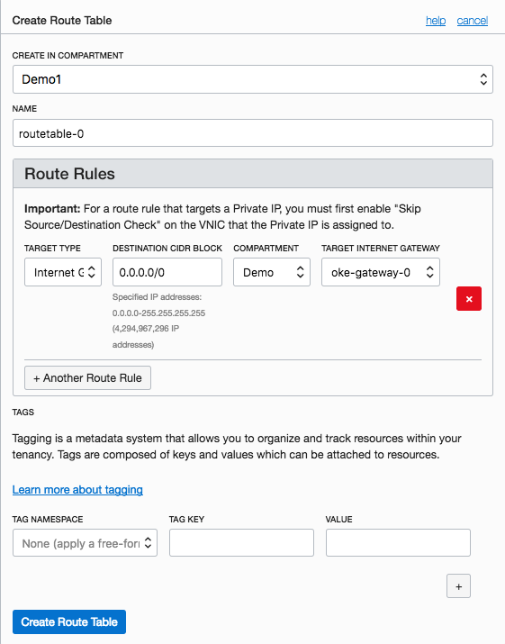

However, if a default Route Table has been created, then you only need to add a new rule to the Route Table.

- Click on the **Default Route Table for oke-cluster** (default generated name) Route Table to enter the details page

- Click on **Edit Route Rules**

- Enter the following:
  - **Destination CIDR block:** `0.0.0.0/0`
  - **Target Type:** `Internet Gateway`
  - **Target Internet Gateway:** `oke-gateway-0`

  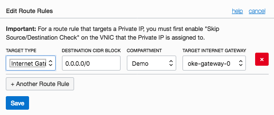

  - Click **Save**
  

### **STEP 2.4**: DHCP Options Configuration

The VCN must have a DHCP Options configured. The default value for DNS Type of Internet and VCN Resolver is acceptable.

- In the VCN `oke-cluster` details page, select **DHCP Options** from the list on the left

  A `Default DHCP Options for oke-cluster` should have been created for you
  
- Click on **Default DHCP Options for oke-cluster** DHCP option to see the detail and you should see something similar to below.

  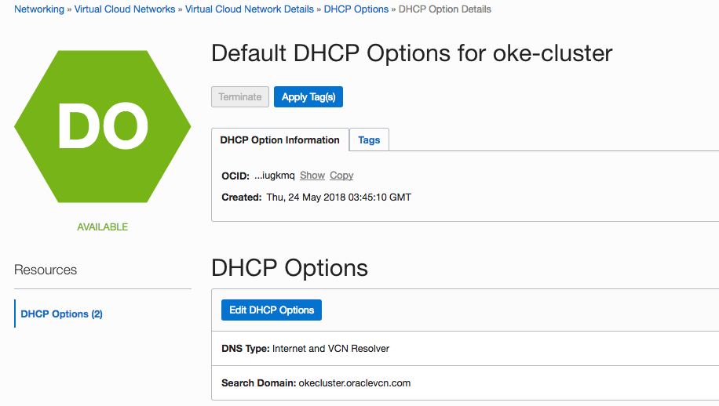

### **STEP 2.5**: Security List Configuration

The VCN must have security lists defined for the Worker Node Subnets and the Load Balancer Subnets. Two security lists need to be created (in addition to the default security list) to control access to and from the worker node subnets and load balancer subnets. The two security lists are named **oke-workers** and **oke-loadbalancers** respectively.

Create two additional security lists to the default `Default Security List for oke-cluster`
  - **Security List Name:** `oke-workers`
  - **Security List Name:** `oke-loadbalancers`
  
There are two types of rules, Ingress and Egress, for both Workers and Load Balancer security lists. There 12 rules in total for the Worker Node Subnet and two rules in total for the Load Balancer Subnet.

Let's create the security lists and rules.

- In the VCN `oke-cluster` details page, select **Security Lists** from the list on the left

  There should be one default security list `Default Security List for oke-cluster` similar to below.

  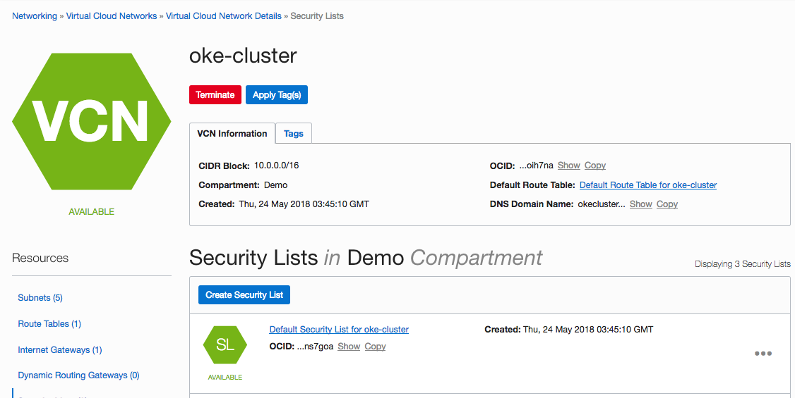

### **STEP 2.5.1**: Create Security List for Work Node Subnets

- Click **Create Security Lists**

- Enter the following for first Ingress rule for **oke-worker** security list name:
  - **Security List Name:** `oke-workers`
  - **Stateless:** `Yes`
  - **Source CIDR:** `10.0.10.0/24`
  - **IP Protocol:** `ALL`

- Click **Add Rule**

  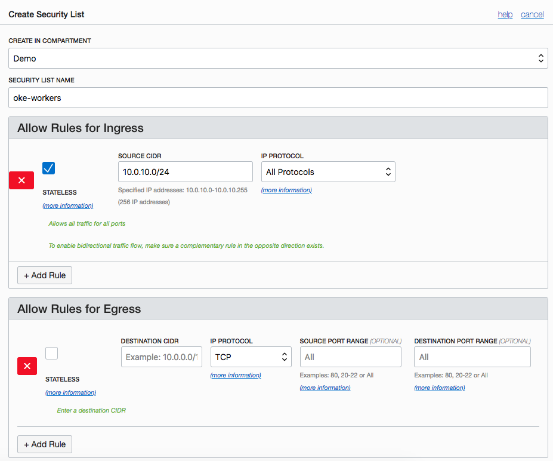

- Repeat the above for the rest of the Ingress rules following the table below from rule number 2 as the first rule has been entered already

  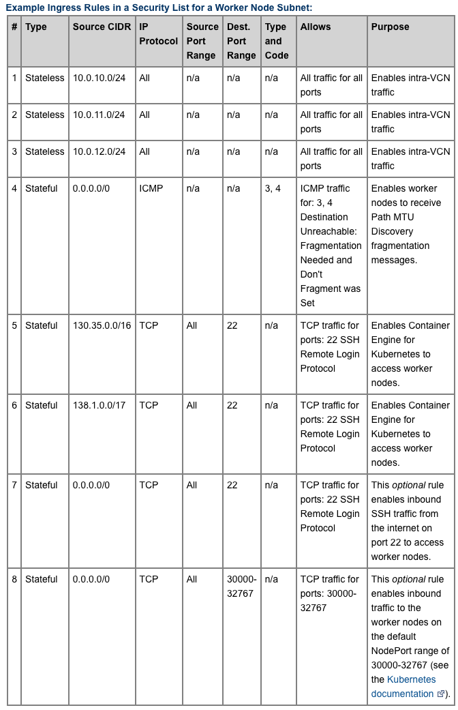

- Before clicking on **Create Security List** button to complete, you need to enter the Ergress rules as well.

- Enter the rest of the Engress rules following the table below:

  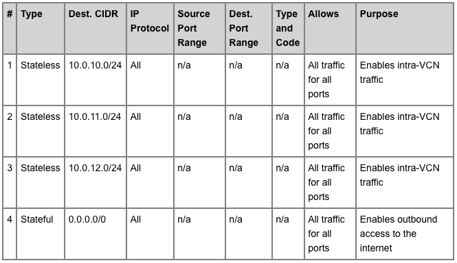

- Click on **Create Security List** button to complete

### **STEP 2.5.2**: Create Security List for Load Balancer Subnets

- Repeat Step 2.5.1 for the Load Balancer subnet using the rules below:

  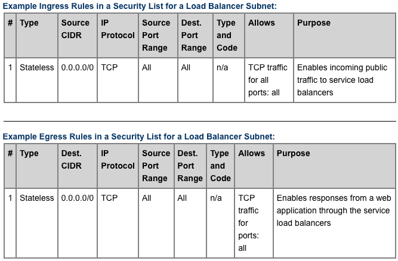

  You should now have three security lists similar to below:

  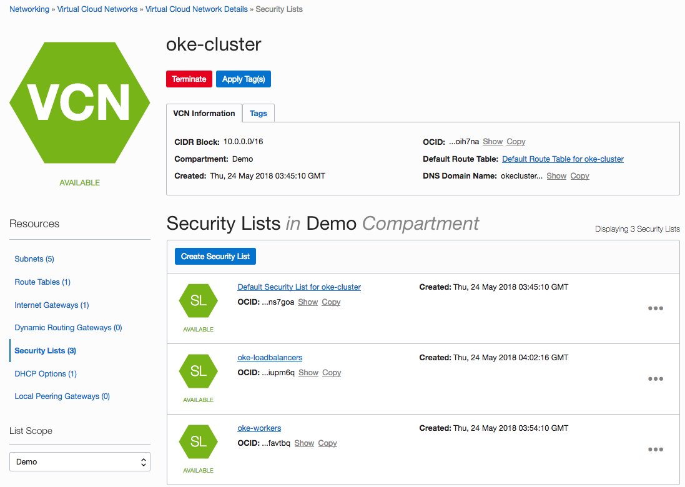

### **STEP 2.6**: Subnet Configuration

We usually require five subnets in the VCN to create and deploy clusters in a highly available configuration. The following configuration assumes you will be deploying across all three Availability Domains.

  - Three subnets in which to deploy worker nodes. Each worker node subnet must be in a different availability domain. The worker node subnets must have different security lists to the load balancer subnets.
  
  - Two subnets to host load balancers. Each load balancer subnet must be in a different availability domain. The load balancer subnets must have different security lists to the worker node subnets.
  
- Still in the VCN page, select **Subnets** from the list on the left

- Click **Create Subnet**

- Enter the following for the first subnet:
  - **Name:** `oke-workers-1`
  - **Availability Domain:** `emra:US-ASHBURN-AD-1`
  - **CIDR Block:** `10.0.10.0/24`
  - **Route Table:** `Default Route Table for oke-cluster`
  - **Public Subnet:** `Allow public IP addresses for instances in this Subnet`
  - **DNS Resolution:** `Use DNS Hostnames In This Subnet`
  - **DHCP Options:** `Default DHCP Options for oke-cluster`
  - **Security Lists:** `oke-workers`

  You should have something similar to below:

  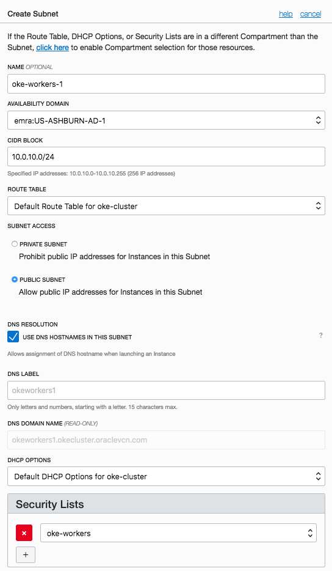

- Click **Create**

- Repeat the above for the remaining two worker subnets **oke-workers-2** and **oke-workers-3** as below:

  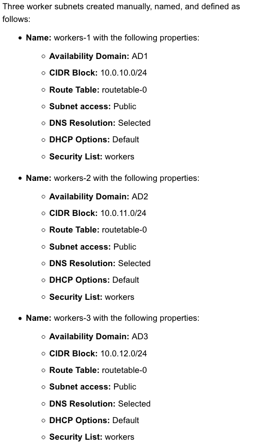

- Repeat the above for the two load balancer subnets **oke-loadbalancer-1** and **oke-loadbalancer-2** as below:

  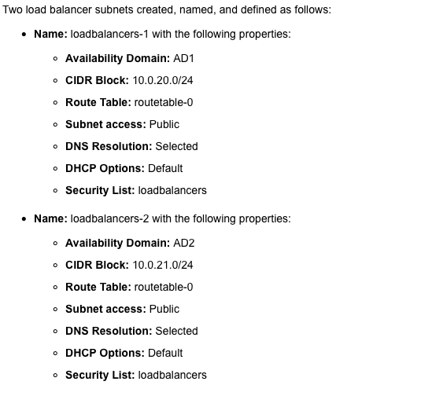

With the five subnets connected, we are ready to create a Kubernetes cluster.

### **STEP 3**: Create a Kubernetes Cluster
  
  
- In the Console, click **Containers**, choose the **Demo** compartment, and then click **Clusters**

- Click **Create Cluster**

- Enter the following configuration details for the new cluster:
  - **Name:** `Demo`
  - **Version:** `v1.9.7`
  - **VCN:** `oke-cluster`
  - **Kubernetes Service LB Subnets:** `oke-workers-1`, `oke-workers-2`
  - **Kubernetes Dashboard Enabled:** `Checked`
  - **Tiller (Helm) Enabled:** `Checked`

  Leave the rest of the fields to default and you should have something similar to below:

  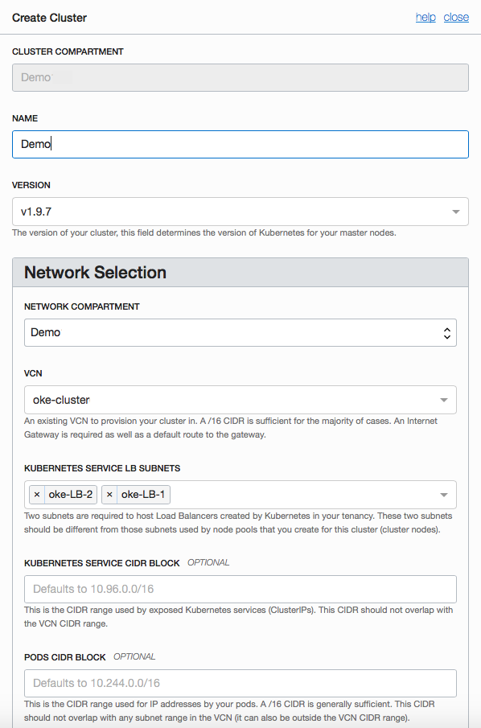

You can either Click **Create** now and create your node pools later OR add the node pools now. Let's add the node pools now to save a step.

- Click **Add Node Pool**

- Enter the following configuration details for the new node pool:
  - **Name:** `workbetter`
  - **Version:** `v1.9.7`
  - **Image:** `Oracle-Linux-7.4`
  - **Shape:** `VM.Standard2.1`
  - **Subnets:** `oke-wokrers-1`
  - **Quantity Per Subnet:** `1`

  Leave the rest of the fields to default and you should have something similar to below:

  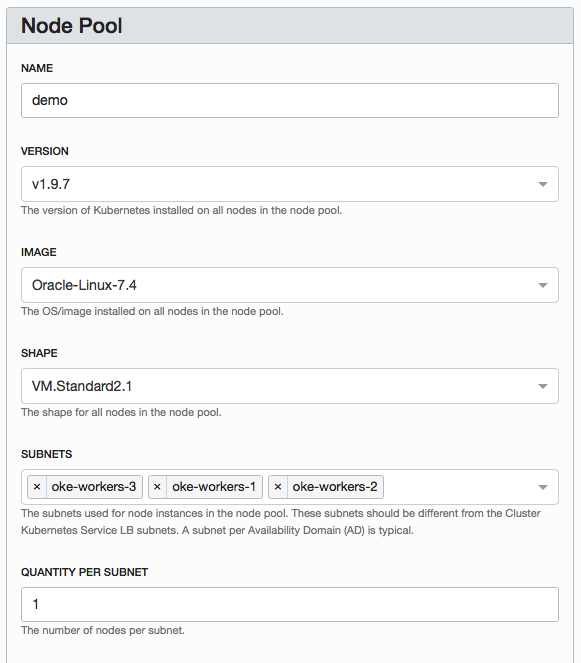

- Click **Create**

The Kubernetes cluster is now ready to use.

### **STEP 4**: Downloading a kubeconfig File to Enable Cluster Access

When you create a cluster, Container Engine creates a Kubernetes configuration file for the cluster called `kubeconfig`. The `kubeconfig` file provides the necessary details to access the cluster using **kubectl** and the Kubernetes Dashboard.

You must download the `kubeconfig` file and set an environment variable to point to it. Having completed the steps, you can start using **kubectl** and the Kubernetes Dashboard to manage the cluster.

### **STEP 4.1**: Generate an API Signing Key Pair

Use OpenSSL commands to generate the key pair in the required PEM format.

- If you haven't already, create a .oci directory to store the credentials:

  `mkdir ~/.oci`

- Generate the private key with one of the following commands:

  `openssl genrsa -out ~/.oci/oci_api_key.pem -aes128 2048`

- Ensure that only you can read the private key file:

  `chmod go-rwx ~/.oci/oci_api_key.pem`

- Generate the public key:

  `openssl rsa -pubout -in ~/.oci/oci_api_key.pem -out ~/.oci/oci_api_key_public.pem`

- Copy the contents of the public key to the clipboard using pbcopy, xclip or a similar tool (you'll need to paste the value into the Console later). For example:

  `cat ~/.oci/oci_api_key_public.pem | pbcopy`

- Get the key's fingerprint with the following OpenSSL command:

  `openssl rsa -pubout -outform DER -in ~/.oci/oci_api_key.pem | openssl md5 -c`

  When you upload the public key in the Console, the fingerprint is also automatically displayed there. It looks something like this: `12:34:56:78:90:ab:cd:ef:12:34:56:78:90:ab:cd:ef`

### **STEP 4.2**: Upload the Public Key of the API Signing Key Pair

You can now upload the PEM public key in the OCI Console.

- In the Console, click **api.user**, and then click **User Settings**. The user details page is now shown.

- Click **Add Public Key**

- Paste the contents of the PEM public key in the dialog box and click **Add**

  You should see something similar to below with the key's fingerprint under the API Keys.

  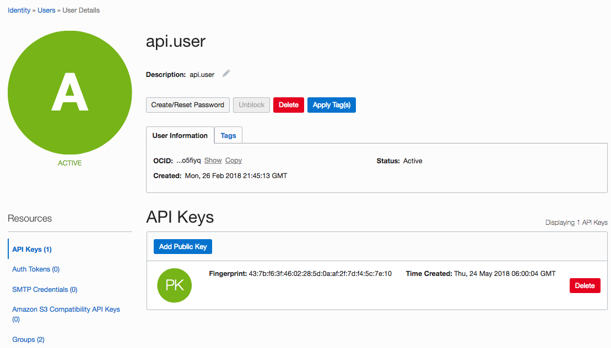

### **STEP 4.3**: Installing the Oracle Cloud Infrastructure CLI

The command line interface (CLI) is a tool that enables you to work with Oracle Cloud Infrastructure objects and services. The CLI provides much the same functionality as the Console and includes additional advanced commands.

There are different installation options and steps to install the CLI and required software depending on your platform. It is not possbile to cover all the options on this page. Please refer to [Installing the CLI Link](https://docs.us-phoenix-1.oraclecloud.com/Content/API/SDKDocs/cliinstall.htm) to install your CLI.

### **STEP 4.4**: Configuring the Oracle Cloud Infrastructure CLI

Before using the CLI, you have to create a config file that contains the required credentials for working with Oracle Cloud Infrastructure. You can create this file using a setup dialog or manually, using a text editor. It is recommended to use the setup dialog.

- Open a shell and run the `oci setup config` command

  The command prompts you for the information required for the config file and the API public/private keys.

- When prompted for the API public/private keys, you can specify the keys you generated previously.

### **STEP 4.5**: Download the kubeconfig.sh File

- In the Console, open the navigation menu. Click **Containers**

- Choose the **Demo** compartment, and then click **Clusters**

- On the **Cluster** List page, click the **Demo** cluster you created. The Cluster page shows details of the cluster similar to below:

  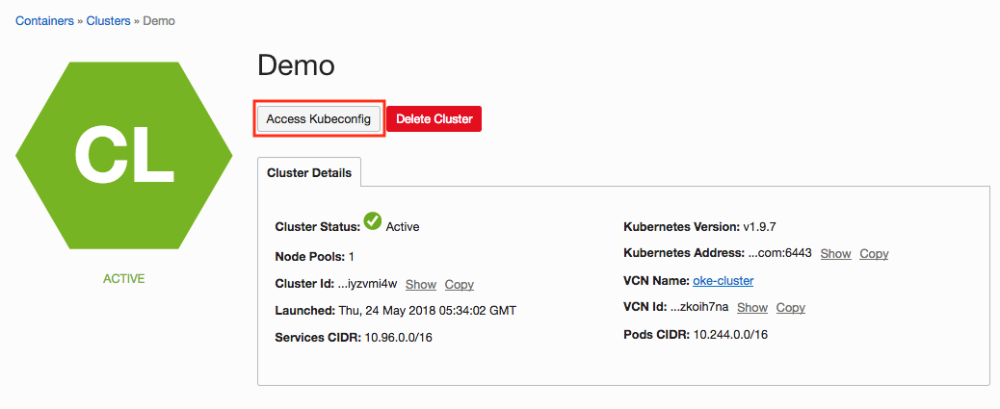

- Click the **Access Kubeconfig** button to display the How to **Access Kubeconfig dialog box**

- Click the **Download script** button to download the `get-kubeconfig.sh` file to a convenient location on the machine where you installed the Oracle Cloud Infrastructure CLI (for example, your home directory).

  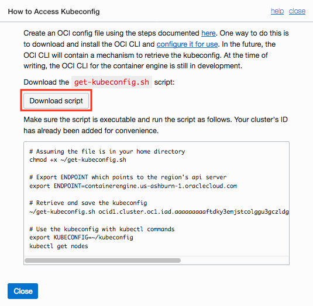

- Make the get-kubeconfig.sh file executable. For example on Linux or MacOS:

  `$ chmod +x ~/get-kubeconfig.sh`

- Set the **ENDPOINT** environment variable to point to the region in which you created the cluster. Use one of us-phoenix-1, us-ashburn-1, eu-frankfurt-1, or uk-london-1 to specify the region. For example, on Linux or MacOS:

  `$ export ENDPOINT=containerengine.us-phoenix-1.oraclecloud.com`

- Run the `get-kubeconfig.sh` file to download the `kubeconfig` file and save it in a location accessible to kubectl and the Kubernetes Dashboard. For example on Linux or MacOS:

  `$ ~/get-kubeconfig.sh ocid1.cluster.oc1.phx.aaaaaaaaae... > ~/kubeconfig`

  Where ocid1.cluster.oc1.phx.aaaaaaaaae... is the OCID of the current cluster.

- For convenience, the command in the How to **Access Kubeconfig** dialog box already includes the cluster's OCID. You can simply copy and paste that command.

### **STEP 4.6**: Set the KUBECONFIG environment variable

- In a terminal window, set the **KUBECONFIG** environment variable to the name and location of the `kubeconfig` file. For example, on Linux or MacOS:

  `$ export KUBECONFIG=~/kubeconfig`

- Verify that **kubectl** is available and that it can connect to the cluster

  `$ kubectl get nodes`

  Information about the nodes in the cluster should be shown.

You can now use kubectl and the Kubernetes Dashboard to perform operations on the cluster.

### **STEP 5**: Starting The Kubernetes Dashboard

Kubernetes Dashboard is a web-based user interface that you can use as an alternative to the Kubernetes kubectl command line tool to:

- deploy containerized applications to a Kubernetes cluster
- troubleshoot your containerized applications

You use the Kubernetes Dashboard to get an overview of applications running on a cluster, as well as to create or modify individual Kubernetes resources. The Kubernetes Dashboard also reports the status of Kubernetes resources in the cluster, and any errors that have occurred.

In contrast to the Kubernetes Dashboard, Container Engine enables you to create and delete Kubernetes clusters and node pools, and to manage the associated compute, network, and storage resources.

Before you can use the Kubernetes Dashboard, you need to specify the cluster on which to perform operations.

To start the Kubernetes Dashboard:

- In a terminal window where you have exported the `KUBECONFIG` environment variable, enter **kubectl proxy** to ebable the Kubernetes Dashboard access.

- Open a browser and go to http://localhost:8001/ui to display the Kubernetes Dashboard.

## **STEP 6**: Deploying to a Cluster

The Kubernetes cluster setup is complete and you are now able to deploy your application to this cluster. This cluster is can be reached by its cluster address. You can find this address either through the OCI console or in the `kubeconfig` file.

- Open the `kubeconfig` file and look for the line with the **server** tag. For example:

  `server: https://cygiyzvmi4w.us-ashburn-1.clusters.oci.oraclecloud.com:6443`
  
  This is the cluster address you should use for deployment, such as the one specified for `KUBERNETES_MASTER` in **Wercker Environment**.
  
Alternatively:

- In the Console, open the navigation menu. Click **Containers**

- Choose the **Demo** compartment, and then click **Clusters**

- On the **Cluster** List page, click the **Demo** cluster you created.

- Under the Cluster Details, you will find the Kubernetes Cluster address similar to below:

  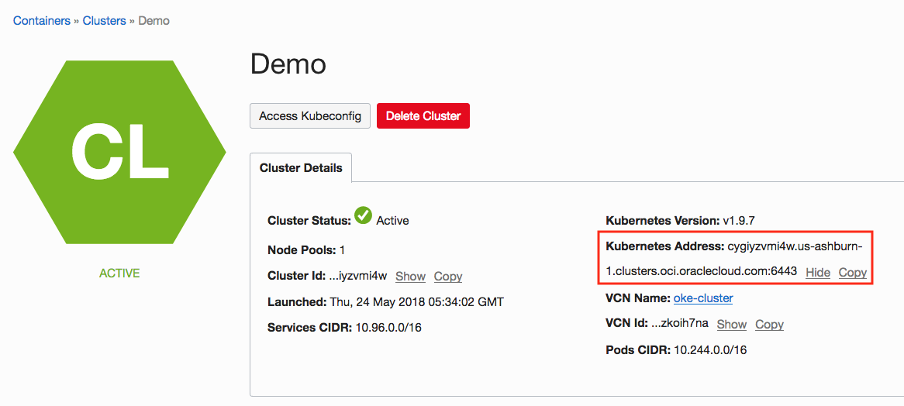

  This should be the same address as the one found in `kubeconfig`.
  
  You are ready to config Wercker to deploy to this cluster.

