# CI/CD Demo - Wercker Container Pipeline

## Demo Introduction

This repository contains the code for the WorkBetter application demo. This demo will walk you through the process of developing an application in a containerised CI/CD pipeline and deploying it to a Kubernetes cluster running on Oracle Cloud Infrastructure.

You will take on the role of a developer, responsible for configuring the automated build and deploy process that involve details about the application itself. To containerise and automate the building and deploying of this application you will make use of Wercker Pipelines, Oracle Container Registry, and Oracle Cloud Infrastrastructure. The Kubernetes infrastructure will be configured and provisioned through Terraform Installer.

On every pipeline execution, the code goes through the following steps:

1. Code is pulled from GitHub, built, tested and deployed to Kubernetes
2. The Docker image is pushed to the internal Oracle Container Registry
3. The application is then tested
3. If passed, the image will be pulled from the registy and deployed to the Kubernetes cluster

## Time to Complete

Approximately 15 minutes

## Scenario

You are an application developer who is developing a container native HR application using JET for building the web application to be used in a browser from a mobile phone up to desptop. This web application is designed as a microservice to run in a Docker container and deployed to Kubenetes.

The reason why you want to adopt a container native approach has partially been driven by the need to go to market quicker, by delivering new features more frequently, but also more reliably. And you are able to do this by developing Microservices that has less dependencies on other services, as well as the footprint being smaller, easier to deploy and starts up faster. What’s also attractive with Microservices is that you can use the best programming language for the job. To be able to deliver this new style of container native application approach, you will need to adopt the Agile development practice to continuously integrate and deliver these services and features. The application basically consists of the user interface that is built using Oracle JET framework, packaged as a Docker image and deployed to a Kubernetes cluster hosted on Oracle Cloud Infrastructure.

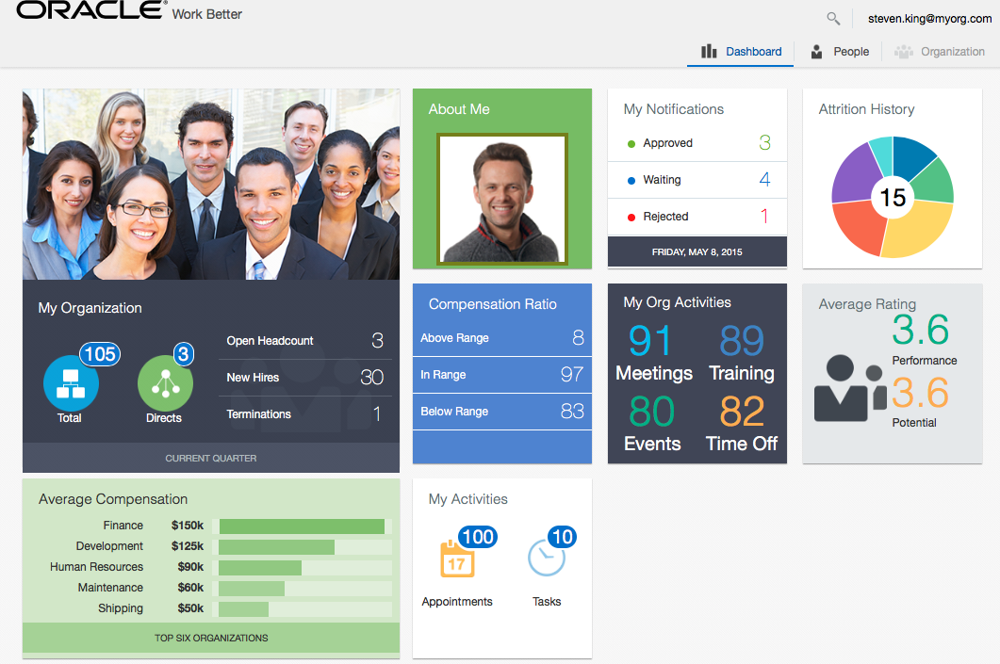

You will use Wercker (Oracle Container Pipeline) as the core CI/CD software lifecycle management tool for your Agile development and DevOps pipeline. The WorkBetter application has already been created in Wercker with the Workflow and Pipelines created. This demo assumes you have a GitbHub and Wercker accounts and Brackets installed locally on your laptop. You must also have a provisioned Kubernetes cluster on Oracle Cloud Infrastructure.

## What You Need?

- GitHub account
- Wercker account
- Oracle Cloud Infrastructure
- A Kubernetes cluster running on OCI
- An installation of Brackets with Bracket Git by Martin Zagora extension installed
- Some familiarity with GitHub
- Some familiarity with Wercker
- Some familiarity with Brackets

## Provision an Oracle Container Engine for Managed Kubernetes Service

This demo requires the Oracle Container Engine for Managed Kubernetes Service (OKE) as the runtime platform.

- If you do not already have an OKE cluster, you must provision one before you can run the demo.
- Please follow the instruction here to provision your OKE cluster [OKE Setup Link](https://github.com/kwanwan/WorkBetter/blob/master/OKEsetup.md).

## Provision a Wercker Project

This demo also requires a Wercker project orchestrating the build and deployment of the Work Better application to an OKE cluster.

- If you do not already have a Wercker project for Work Better, you must create and configure one before you can run the demo.
- Please follow the instruction here to create your Work Better project in Wercker [Wercker Setup Link](https://github.com/kwanwan/WorkBetter/blob/master/Werckersetup.md).

## Demo Steps

### **Step 1**: Introduce the Work Better application

Work Better is a HR web application written in JET. This web application is designed as a microservice to run in a Docker container and deployed to Kubenetes. It is continuously integrated and deployed to a Kubernetes cluster running on OCI.

* Go to the Work Better dashboard
* Click on some of the items

  

### **Step 2**: Introduce Wercker (Oracle Container Pipeline)

Wercker is the next generation container lifecycle management tool. You can create Pipelines that enable full build, test and deployment workflows to execute. It supports Docker-native continuous integration and delivery of microservices and functions with a full set of collaboration tools. And Releases are deployed and managed through Kubernetes and built-in Container Registry Service. So that container images are stored and shared across multiple deployments on Oracle Cloud with our private registry. You can also operate Kubernetes deployments to manage and monitor production applications; scale up and scale down your clusters - secure and load balanced.

Also explain about the GitHub repository was added to the workflow when the application is created and configured in Wercker.

* Go to the Wercker WorkBetter application
* Describes the navigation tab along the top
* Click on the **Runs** tab

  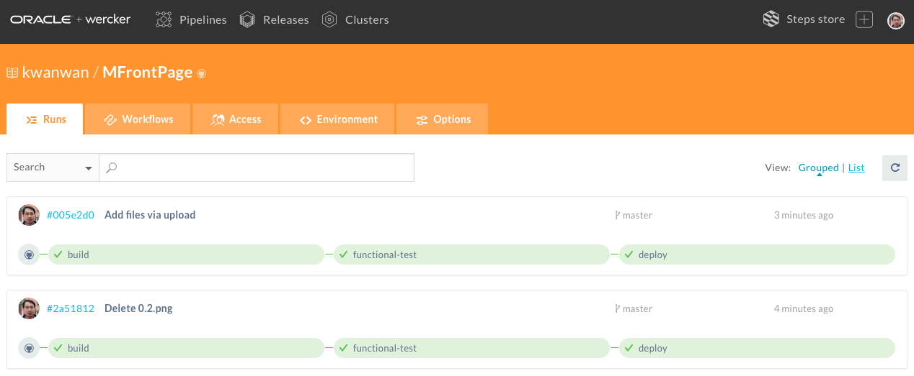

### **Step 3**: Walkthrough the WorkBetter workflow

A Workflow in Wercker is how the automation of pipelines are managed. You can interconnect multiple pipelines together to form a workflow. A pipeline can be triggered by a GitHub push or by the previous pipeline.

* Click on the **Workflow** tab

* Explain each pipleine in the workflow:

  * The **build** pipeline is created by default and it is triggered whenever a commit is made to the GitHub repo or by a GitHub push.
  * The **functional-test** pipeline is triggered by a successful build.
  * The **deploy** pipeline is triggered by a successful functional test with a condition for changed made to the **_master_** branch only. This enables the testing of code in a new branch before being merged into the master for release.

  

### **Step 4**: Walkthrough the application environment variables

You can define your application environment variables externally under the **Environment** tab. Some of the variables are common standard variables defined by Dockers or Kubernetes, such as the Kubernetes master node address for application deployment, and its token. Similarly, the Docker user and password can be defined here so that the image can be pulled from the registry for deployment.

* Click on the **Environment** tab
* Describe the variables
* Highlight the token or key are protected and cannot be displayed or copied for security reason

  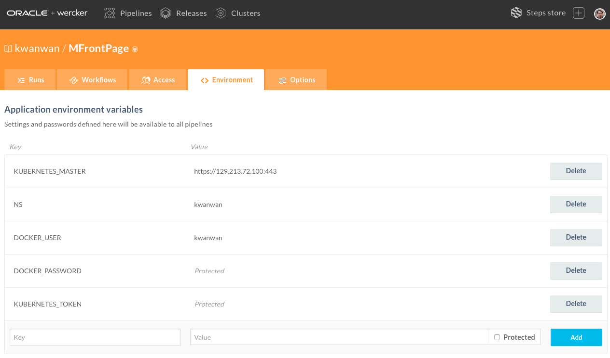

### **Step 5**: Walkthrough the Kubernetes dashboard

You can monitor and manage your Kurbernetes cluster through its dashboard. Not everything can be managed from this console as the Kubernetes cluster is provisioned on Oracle Cloud Infrastructure. For more details please open the OCI console where you will find the master, worker, etcd and load balancer nodes.

* Open the Kubernetes dashboard
* Select **_Namespace_** and corralate it with the NS environment variable
* Select **_Overview_** show all
* Select **_Service_**
* Highlight the **_External endpoints_**, this is the IP address to access the WorkBeter application

  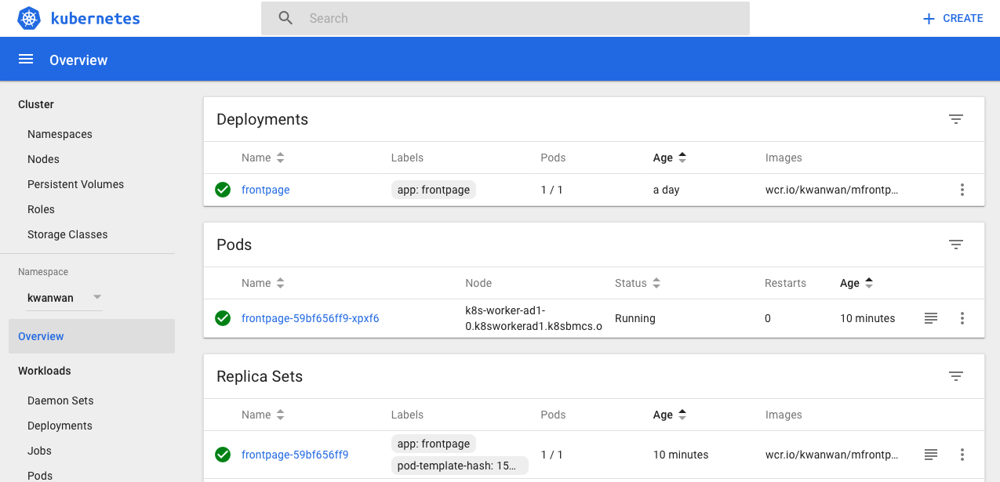

### **Step 6**: Demostrate a code change

We want to demonstrate how we can trigger a new build by making a code change. The profile picture for Steven King is presented in a square frame. We can change this to be presented in a circular frame.

  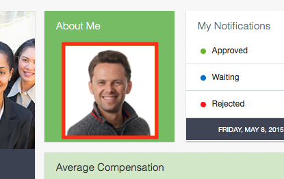

We can change this by changing a line of code we previously commented it out in the **_dashboard.html_** under **_WorkBetter/website/js/views_** in our GitHub repo.

* Go to the GitHub WorkBetter repo
* Open the **_dashboard.html_** file
* Locate lines 44 to 47 where the dashboard photo is defined

  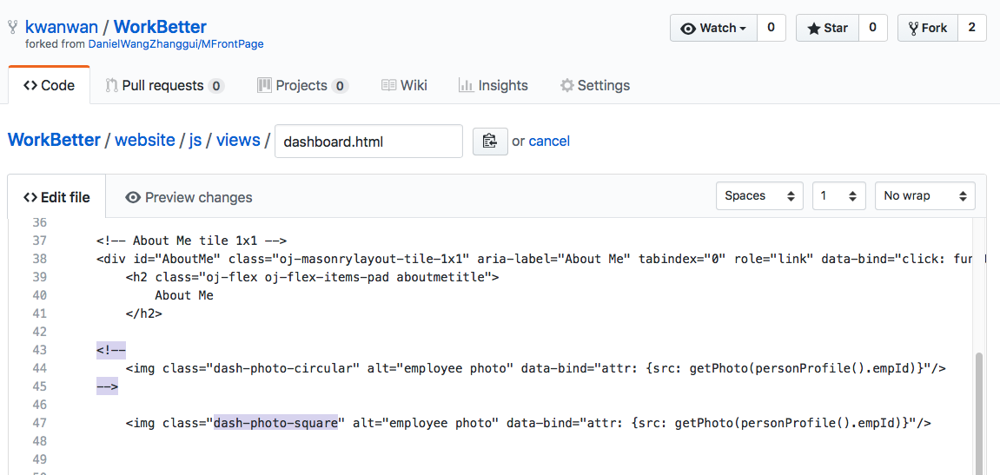

* All we got to do is swap the comments tags around like so

  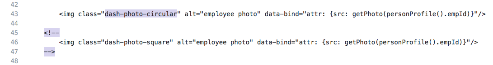

### **Step 7**: Working with code

There are a number of ways to work with your code. Most developers will be working with an IDE or some OpenSource editors. Or you could make the change directly in the GitHub online editor.

#### **Step 7.1**: Changing the code in GitHub online editor

Using the GitHub online editor is straight forward, however, this is not the preferred way of developing an application. When a new branch is created, it will trigger the **build** and **functional-test** pipeline, but without excuting the **deploy** pipeline.

* Instead of committing the code to the **_master_** branch, we will create a new branch
* Check the **Create a new branch for the commit and start a pull request** at the bottom of the file
* Enter **v1.1** in the new branch field
* Click on **Propose file change**

  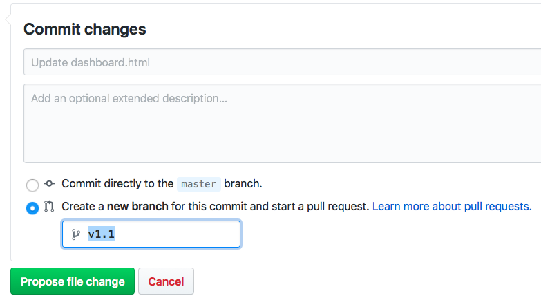

* You have now made a change to the file in a new branch

**_Since you've made code changes in the GitHub online editor, you can now go straight to Step 9_**

#### **Step 7.2**: Changing the code in Brackets

As I have the Brackets editor installed and synchronised with my GitHub repo, I can use Brackets to illustrate how I create a new branch for the code change and push it back to the repo to trigger the **build** and **functional-test** pipeline, but without excuting the **deploy** pipeline.

* Open Brackets
* Create a new branch **v1.1**

  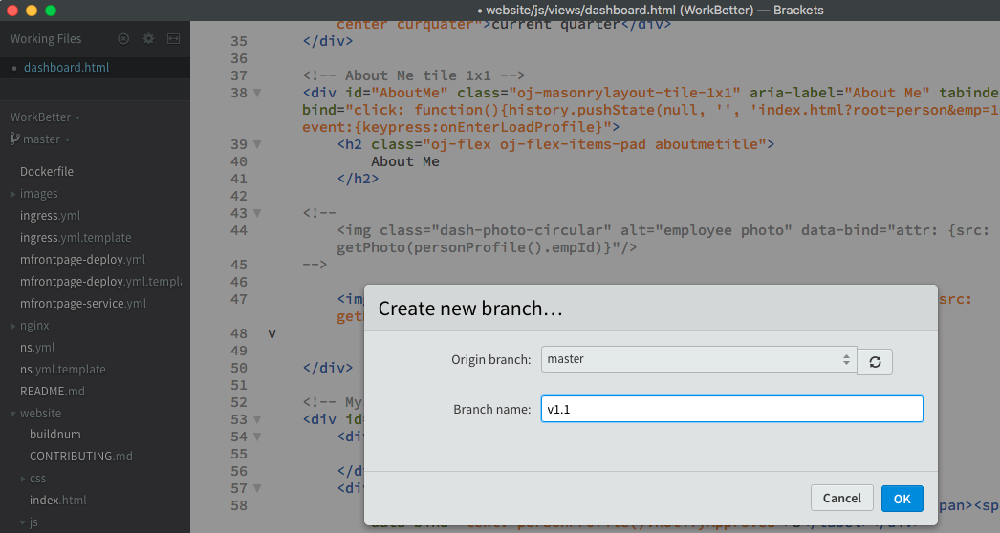

* Open the **_dashboard.html_** file
* Locate lines 44 to 47 where the dashboard photo is defined
* Swap the comments tags around
* Save the file

  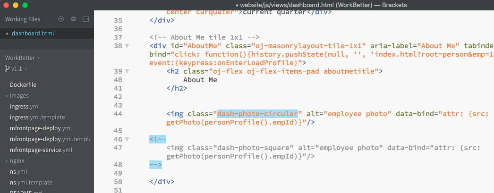

### **Step 8**: Push change to GitHub

We have now made the code change in the new **v1.1** branch and need to push the changes back to GitHub.

* Click on **Commit** button to commit the changes
* Enter a commit message
* Click on **Git Push** button synchronise

  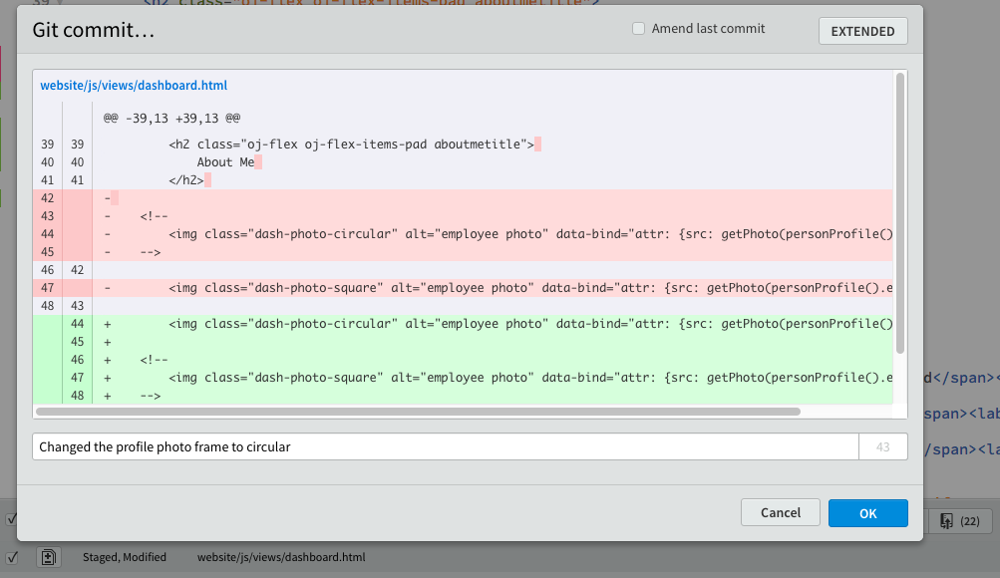

### **Step 9**: Monitor the pipeline execution

The moment we commit the Git push, the **build** pipeline would be triggered in Wercker. Please take note of the pipelines to be executed. The **build** and **functional-test** should be the only pipelines to be executed as the **deploy** pipeline is executed only on changes to the **_master_** branch. Since we have made the changes in a new branch, we can therefore test it without deploying it to production.

* Switch back to Wercker
* Click on the **Runs** tab
* Observe the workflow
* Click into the pipelines and expand the steps for more detail

  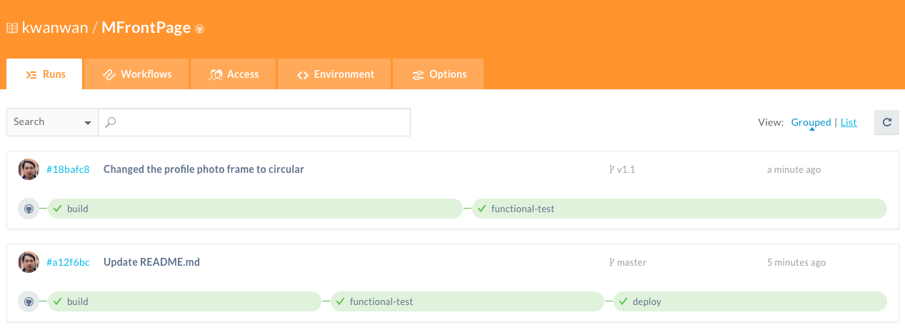

### **Step 10**: Merge branch and deploy changes to environment

If the previous pipelines completed sucessfully then we can commit the changes into the master branch by merging the **_v1.1_** to the **_master_**. This will automatically trigger a deployment by calling the **deploy** pipeline. Instead of using Brackets to merge the branches, lets use the GitHub editor instead as you can see the steps better visually.

* Switch to GitHub editor
* Create pull request
* Click on **Merge pull request**

  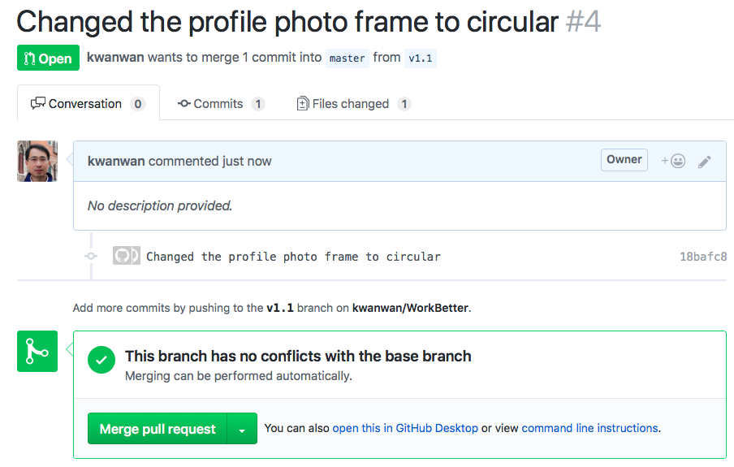

### **Step 11**: Monitor the pipeline execution

Once we commit the merging of the **_master_** and **_v1.1_**, the workflow will be triggered. Please take note of the pipelines to be executed. This time we will execute the **deploy** pipeline as changes have been merged with the **_master_** branch.

* Switch back to Wercker
* Click on the **Runs** tab
* Observe the workflow
* Click into the pipelines and expand the deploy for more detail

  

### **Step 12**: Reload the WorkBetter application

You can now see the changes by reloading your browser page. The key message is how agile it is to continuously integrate and deploy new features to the end users. And we shown the support of CI/CD with Wercker (Oracle Container Pipeline). With Wercker, the deployment can be to any Kurbenetes cluster but it will be even better with Oracle Kubernetes Engine which is a managed Kubernetes environment.

* Reload WorkBetter dashboard in your browser
* Observse the profile photo changed to a circular frame

  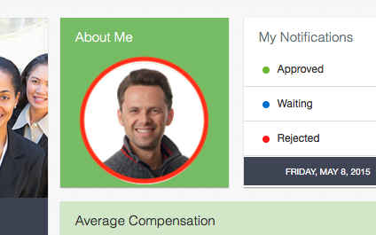

## End

