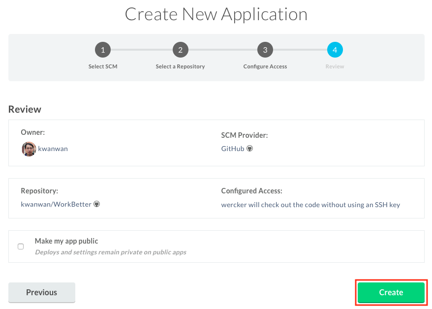

# Provision Wercker for Work Better Application

## Preparing Wercker

Before you can use Wercker to build and deploy to a OKE cluster, you must have access to a:

- GitHub account
- Wercker account
- A OKE cluster

## Creating a Work Better Application in Wercker

### **Step 1**: Create an Application in Wercker

To create an application (aka project) in Wercker, you need to log in to Wercker with a GitHub account.

- Go to the [Wercker Home](http://www.wercker.com) and log in with your GitHub username

- Click **LOG IN WITH GITHUB**

- Once logged in, click on the **+** sign icon on the top right hand corner of the page and select ** Add application** from the drop down list.

- Select **GitHub** as your SCM on the **Create New Application** page, and click **Next**

- Select your forked WorkBetter repository from the **Select a Repository** step, and click **Next**

- Leave the recommended selection on the **Configure Access** step to use **wercker will check out the code without using an SSH key**, and click **Next**

- Review your selections and click **Create**

  You should have something similar to below:
  
  

